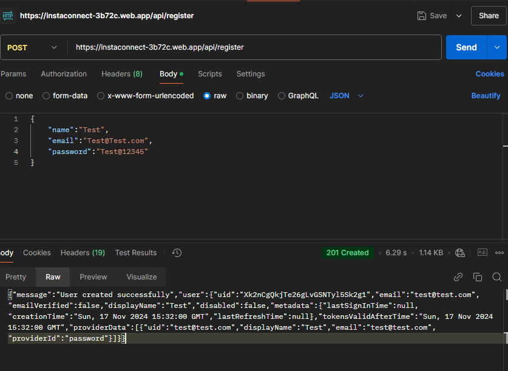
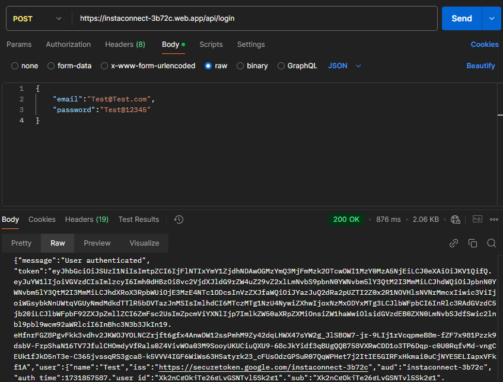
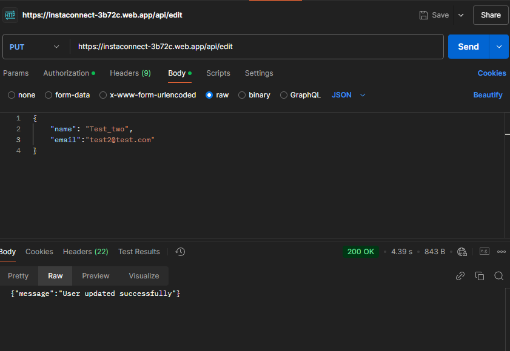
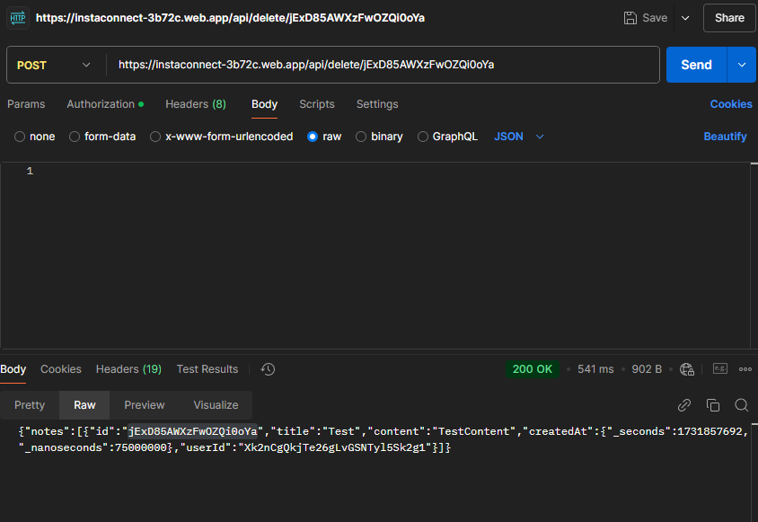
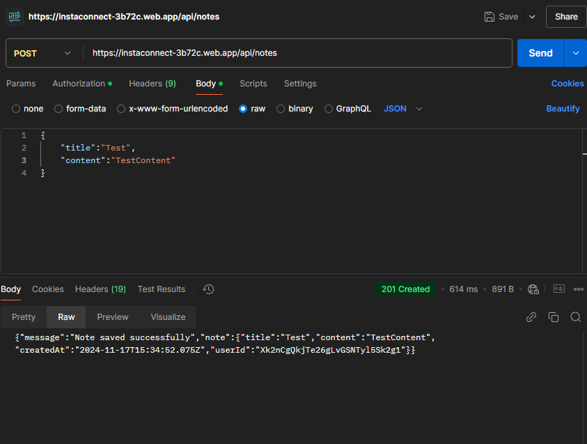
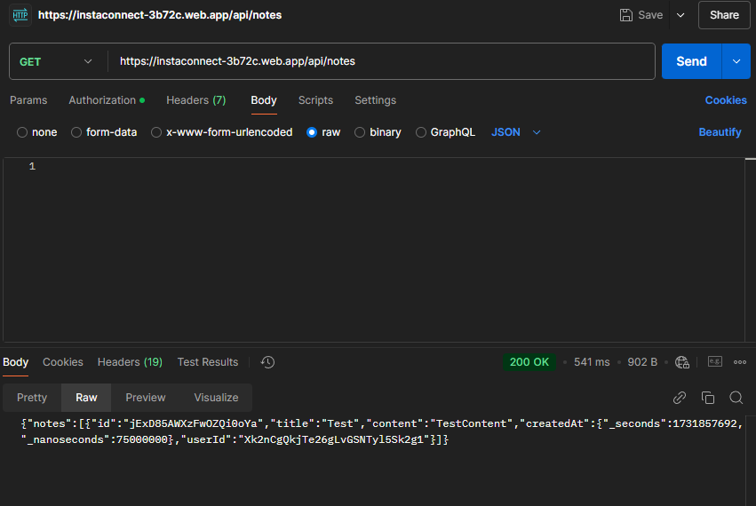

# Node.js API with TypeScript, Express, Firebase Authentication, and Firestore

This is a Node.js application built with TypeScript using Express for API endpoints, Firebase for authentication, and Firestore for data storage. The application includes user management and notes management functionalities for authenticated users.

- Live API URL :  https://instaconnect-3b72c.web.app/

## Table of Contents

- [Features](#features)
- [Tech Stack](#tech-stack)
- [Setup](#setup)
- [Environment Variables](#environment-variables)
- [API Endpoints](#api-endpoints)
- [Validation Schemas](#validation-schemas)
- [Folder Structure](#folder-structure)
- [Deployment](#deployment)
- [Testing with Firebase Emulator](#testing-with-firebase-emulator)

## Features

- User registration and login with Firebase Authentication
- Secure notes creation and retrieval for authenticated users
- Input validation using middleware
- TypeScript for type safety and better development experience
- Deployed using Firebase Cloud Functions

## Tech Stack

- **Node.js** with **TypeScript**
- **Express** for building RESTful APIs
- **Firebase Authentication** for user management
- **Firestore** as the database for storing notes
- **Firebase Cloud Functions** for serverless deployment

## Setup

### Prerequisites

- Node.js (v18.x)
- Firebase CLI
- Firebase Project

### Installation

1. Clone the repository:
```bash
   git clone https://github.com/ADKANK/User_Management_Intellectworks.git
   cd User_Management_Intellectworks
```
2. Install dependencies:
```bash
    npm install
```
3. Compile TypeScript files:
```bash
    npx tsc
```

4. Start the server locally:
```bash
    npm run serve
``` 

### Environment Variables

1. Create a .env file in the root directory and add the following variables:
    ```bash
    WEB_API_KEY="your_FIREBASE_WEB_API_KEY"
    ```

- **Using Firebase Firestore Database**
    - Inside the Database, there are two collections: `users` and `notes`
        - **users**: 
            - `{ "name": "someName", "email": "someName@someName.com", "password": "someNamePassword" }`
        - **notes**: 
            - `{ "title": "someTitle", "content": "someContent" }`


## API Endpoints

### User Management

- **POST** `https://instaconnect-3b72c.web.app/api/register`: Register a new user  
    Request Body:
    ```json
    {
        "name":"someName",
        "email":"someName@someName.com",
        "password":"someNamePassword"
    }
    ```

    

- **POST** `https://instaconnect-3b72c.web.app/api/login`: User login  
    Request Body:
    ```json
    {
        "email":"someName@someName.com",
        "password":"someNamePassword"
    }
    ```

    

- **PUT** `https://instaconnect-3b72c.web.app/api/edit`: Edit user details (At least one field required)  
    1. **POST** `https://instaconnect-3b72c.web.app/api/login`: First, login ,get the token and also the id.
    2. Go to the **Authorization** tab in Postman and select **Bearer Token**.
    3. Paste the token into the Bearer Token field.
    4. Send the **Edit** request
    Request Body:
    ```json
    {
        "name" : "someName",
        "email":"someName@someName.com",
        "password":"someNamePassword"
    }
    ```
    

- **DELETE** `https://instaconnect-3b72c.web.app/api/delete/:id`: Delete user account  
    Steps to delete a user:
    1. **POST** `https://instaconnect-3b72c.web.app/api/login`: First, login ,get the token and also the id.
    2. Go to the **Authorization** tab in Postman and select **Bearer Token**.
    3. Paste the token into the Bearer Token field.
    4. Send the **DELETE** request

    

### Authenticated Tasks (Requires Authentication)

- **POST** `https://instaconnect-3b72c.web.app/api/notes`: Create a new note  
    Steps to create a note:
    1. Login and get the token from the login API.
    2. Go to the Authorization tab in Postman and select **Bearer Token**.
    3. Paste the token.
    4. Request Body:
    ```json
    {
        "title" : "someTitle",
        "content":"someContent"
    }
    ```

    

- **GET** `https://instaconnect-3b72c.web.app/api/notes`: Retrieve notes  
    Steps to retrieve notes:
    1. Login and get the token from the login API.
    2. Go to the Authorization tab in Postman and select **Bearer Token**.
    3. Paste the token.
    4. Send the GET request to [https://instaconnect-3b72c.web.app/api/notes](https://instaconnect-3b72c.web.app/api/notes)

    


### Validation Schemas
    This project uses Joi for input validation to ensure the incoming request data is formatted correctly. Below are the instructions for the validation schemas used in the application:
- User Registration (registerUserSchema)

    - Validates user registration data, including email, password, and name.
    - The email field must be a valid email address.
    - The password field must be at least 6 characters long.
    - The name field must be at least 2 characters long.

- User Edit (editUserSchema)

    - Validates the data for editing a user's email and/or name fields.
    - Either the email or the name field must be provided for editing.
    - If provided, email must be a valid email and name must be at least 2 characters long.

- User Deletion (deleteUserSchema)

    - Validates that the userId is provided when deleting a user.
    - The userId field must be a string and is required for deletion.

- Save Note (saveNoteSchema)

    - Validates the data for creating a new note.
    - The title and content fields must be at least 1 character long and are required.
    - These schemas help ensure the data integrity and user experience by providing clear error messages when invalid data is received.


### Folder Structure

- src
  - /lib                           #Compiled JavaScript files after TypeScript compilation
  - /controllers
    - userController.ts          # User management logic (register, login, edit, delete)
    - notesController.ts         # Notes management logic (create, retrieve)
  - /middleware
    - validateRequest.ts         # Middleware for validating request data
  - /services
    - authLogin.ts               # Service for handling Firebase login and generating tokens
  - /validators.ts                 # Validation schema for user registration,edit user,user deletion, saving notes
  - index.ts                     # Main file to start the application and define API routes
  - .env                           # Environment variables (API key)
  - package.json                   # Project dependencies and scripts
  - tsconfig.json                  # TypeScript configuration
  - firebase.json                  # Firebase project configuration
  - .gitignore                     # Files to ignore in version control


### Deployment
This project is deployed using Firebase Cloud Functions.

- Deploy to Firebase
    - To deploy the functions to Firebase, follow these steps:

    - Make sure you are logged into Firebase CLI:
    ```bash
        firebase login
        firebase deploy --only functions
    ```

### After deploying, your application will be live on Firebase Cloud Functions.

# Testing with Firebase Emulator
 - To test the Firebase functions locally using the Firebase Emulator, you can use the following scripts from your package.json:

# Build and Start Firebase Emulator:
```bash
npm run serve
```
This command will compile TypeScript files and start the Firebase emulators, allowing you to test the functions locally.

# Deploy to Firebase:
```bash
npm run deploy
```
This command will deploy the Firebase functions to the cloud.

View Firebase Logs:
```bash
npm run logs
```
This command will show the logs of the Firebase functions, useful for debugging.


